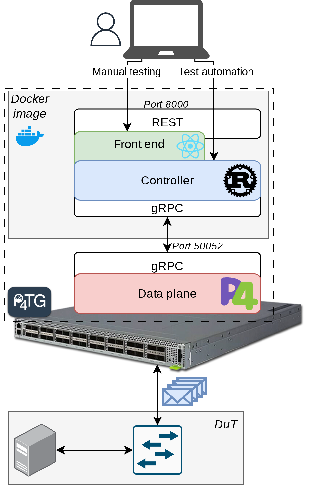
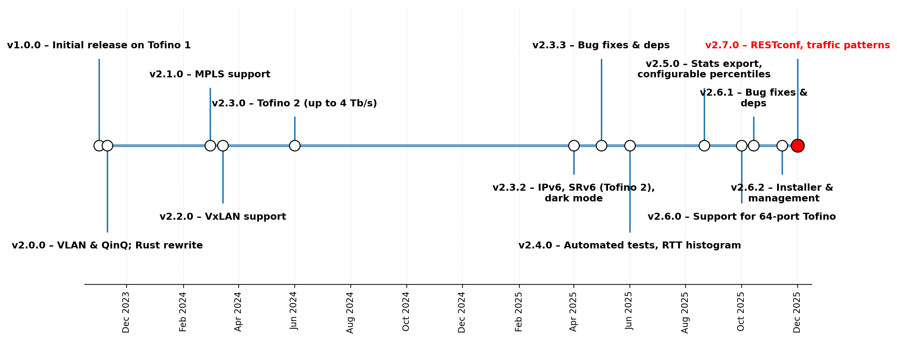
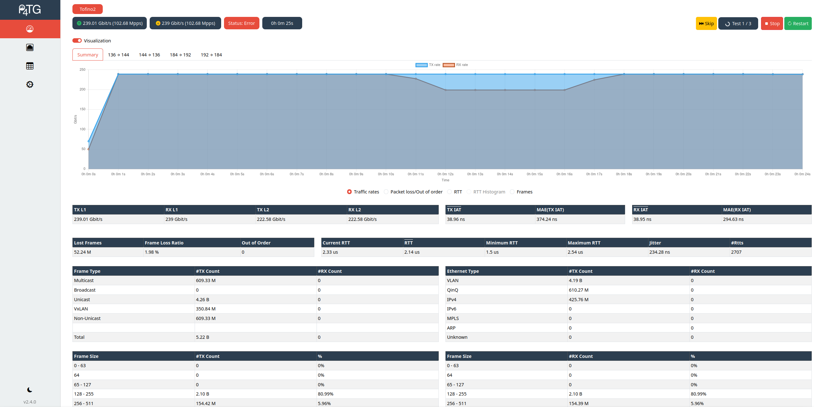
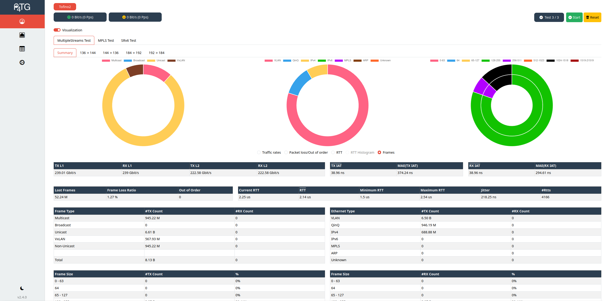
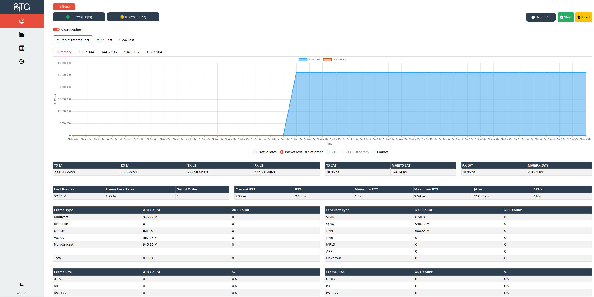
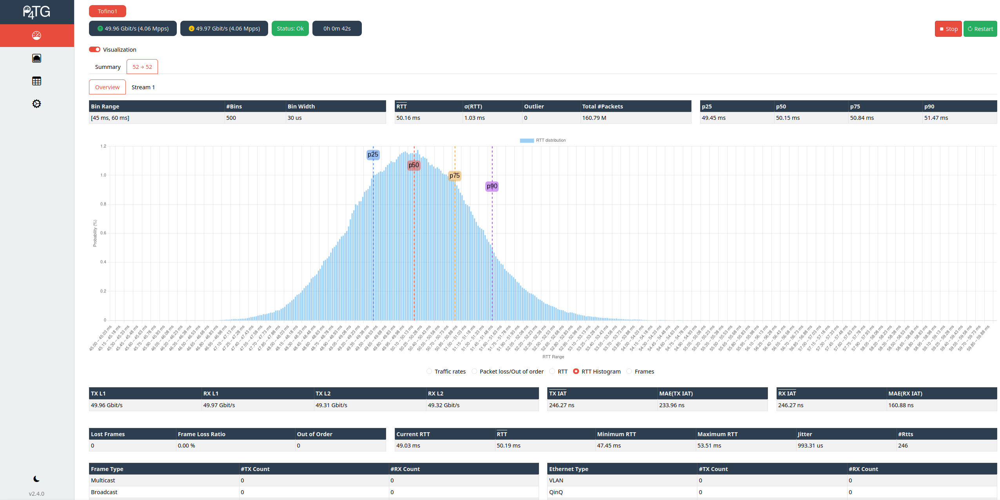
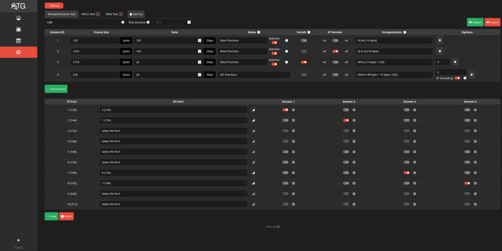

<div align="center">
  

  <h2>P4TG: Traffic Generation for Ethernet/IP Networks</h2>

  
  
  
  
  [](https://github.com/uni-tue-kn/P4TG/actions/workflows/docker-image.yml)
  [](https://github.com/uni-tue-kn/P4TG/actions/workflows/docker-sde-image.yml)
</div>

---

## 📑 Table of Contents
- [📑 Table of Contents](#-table-of-contents)
- [📝 Overview](#-overview)
  - [Traffic Generation](#traffic-generation)
  - [Statistics](#statistics)
  - [Version Highlights](#version-highlights)
  - [Features](#features)
- [🚀 Installation \& Quick Start](#-installation--quick-start)
  - [Quick Start](#quick-start)
  - [Configuration](#configuration)
    - [Configuration Options](#configuration-options)
    - [64-port Tofino](#64-port-tofino)
- [🤖 Test Automation](#-test-automation)
- [🔄 Update Guide](#-update-guide)
  - [Manually](#manually)
- [📚 Documentation](#-documentation)
- [🛠️ Development](#️-development)
- [🖼️ Preview](#️-preview)
- [🏢 Who's Using P4TG](#-whos-using-p4tg)
- [📖 Cite](#-cite)

---

## 📝 Overview

**P4TG (P4-based Traffic Generator)** is a programmable traffic generator built on the **Intel Tofino™ ASIC**.  
It enables reproducible experiments with Ethernet/IP traffic at high data rates while providing precise in-data-plane measurements.  
P4TG combines a **P4 data plane program**, a **Rust-based control plane**, and a **React-based configuration GUI**.

<div align="center">
    
</div>

---

📖 Related publications:  
- [P4TG: 1 Tb/s Traffic Generation for Ethernet/IP Networks](https://ieeexplore.ieee.org/document/10048513) (v1.0.0)  
- [Enhancements to P4TG: Protocols, Performance, and Automation](https://publikationen.uni-tuebingen.de/xmlui/handle/10900/163776) (v2.3.2)
- [Enhancements to P4TG: Histogram-Based RTT Monitoring in the Data Plane](https://doi.org/10.14279/depositonce-24399) (v2.4.0)


---

### Traffic Generation
- **Tofino 1:** Up to **1 Tb/s** across 10 × 100 Gb/s ports, or 40 × 10/25 Gb/s
- **Tofino 2:** Up to **4 Tb/s** across 10 × 400 Gb/s ports, or 40 × 10/25/100 Gb/s, or 80 × 10/25/50 Gb/s in channelized mode

Generated packet headers can be fully customized, including:
- Ethernet
- IPv4 (full address randomization)
- IPv6 (address randomization of 48 LSB)
- MPLS (up to 15 LSEs)
- VLAN
- QinQ
- VxLAN
- SRv6 (up to 3 SIDs, Tofino2 only)

### Statistics

Traffic may be looped back (directly or through other equipment) to measure:
- TX/RX rates
- Packet loss
- Packet reordering
- Inter-arrival times (IATs)
- Round-trip times (RTTs)
- Frame types
- Frame sizes

directly in the data plane to ensure accurate results.

---

### Version Highlights

<div align="center">
    
</div>

See the full [Changelog](./docs/CHANGELOG.md).

---

### Features

| Feature                                       | Status         |
| --------------------------------------------- | -------------- |
| Statistics                                    | ✅ Available    |
| Tofino 1 & 2 support                          | ✅ Available    |
| Web frontend (React)                          | ✅ Available    |
| Rust backend                                  | ✅ Available    |
| Ethernet, IPv4, IPv6                          | ✅ Available    |
| VLAN, QinQ, MPLS, VxLAN, GTP-U, SRv6          | ✅ Available    |
| ARP replies                                   | ✅ Available    |
| Dark mode                                     | ✅ Available    |
| IAT+RTT histogram & percentiles               | ✅ Available    |
| Automated testing                             | ✅ Available    |
| Line rate traffic patterns (e.g., flashcrowd) | ✅ Available    |
| File reporting                                | ✅ Available    |
| Test profiles                                 | ⚠️ Experimental |
| Localization                                  | ⚠️ Experimental |
| NDP                                           | ⏳ Planned      |
| NETCONF                                       | ⏳ Planned      |

## 🚀 Installation & Quick Start

P4TG requires a fully set up bf-SDE with `$SDE` and `$SDE_INSTALL` environment variables set.
A detailed installation guide for the Intel SDE and P4TG can be found [here](./docs/INSTALL.md).

### Quick Start

The provided `p4tg.sh` script automates the installation of the data and control plane on Debian- / Ubuntu-based systems, provided that the SDE is installed correctly.
Make sure that the environment variables `$SDE` and `$SDE_INSTALL` are set. Run with `sudo -E` to pass environment variables.
```bash
Usage: sudo -E ./p4tg.sh [install|update|start|stop|restart|status][--nightly]
```
Clone P4TG into `/opt/P4TG` and simply run `sudo -E ./p4tg.sh install` (tested on Debian-based systems). Change the paths at the top of `p4tg.sh` if needed.

The `install` command will:
- Compile the data plane and copy it in place.
- Pull the docker image and start it.
- Copy the `p4tg.sh` script to `/usr/local/bin`.
- Copy the `p4tg.service` file to `/etc/systemd/system/p4tg.service`. This service file can be used to autostart P4TG on boot.

The `start` command will:
- Load all required kernel modules to operate the Tofino.
- Start the data plane and wait for it to become ready.
- Start the control plane docker image.

The control plane docker image:
- Starts a REST-API server on port `P4TG_PORT` (default: `8000`) at `/api`  
- Serves the React GUI at `/`  
- Access GUI: `http://<tofino-controller-ip>:P4TG_PORT`
- Access API: `http://<tofino-controller-ip>:P4TG_PORT/api`

---

### Configuration
**Docker compose file** `Controller/docker-compose.yaml` 
- `SAMPLE=1` → IAT sampling mode (default: `0`, data plane measurement)
- `LOOPBACK=true` → enable loopback testing mode
- `P4TG_PORT=8000` → changes the controller port
- `NUM_PORTS=32` → set number of front panel ports of your device


**Config file:** `Controller/config.json`  
- Specify ports for traffic generation. Per default, front panel ports 1 - 10 are configured automatically.
- Configure MAC address for ARP replies, `channel_count`, and port settings. Port settings can further be changed during runtime through the API or the GUI.

Example:
```json
{
  "tg_ports": [
    {
      "port": 1,
      "mac": "00:d0:67:a2:a9:42",
      "speed": "BF_SPEED_100G"
    },    
    {
      "port": 2,
      "mac": "fa:a6:68:e0:3d:70",
      "channel_count": 4,
      "speed": "BF_SPEED_25G"
    },
    {
      "port": 4,
      "mac": "d6:67:75:a1:94:c3",
      "channel_count": 8,
      "speed": "BF_SPEED_50G"
    },
    {
      "port": 3,
      "mac": "00:d0:67:a2:a9:42",
      "speed": "BF_SPEED_100G",
      "fec": "BF_FEC_TYP_NONE",
      "auto_negotiation": "PM_AN_FORCE_DISABLE"
    }
  ]
}
```

#### Configuration Options

| Option             | Valid Values                                                                                          |
| ------------------ | ----------------------------------------------------------------------------------------------------- |
| `mac`              | Any valid MAC address                                                                                 |
| `speed`            | `BF_SPEED_10G` · `BF_SPEED_25G` · `BF_SPEED_40G` · `BF_SPEED_50G` · `BF_SPEED_100G` · `BF_SPEED_400G` |
| `channel_count`    | `4` · `8`                                                                                             |
| `auto_negotiation` | `PM_AN_DEFAULT` · `PM_AN_FORCE_ENABLE` · `PM_AN_FORCE_DISABLE`                                        |
| `fec`              | `BF_FEC_TYP_NONE` · `BF_FEC_TYP_FC` · `BF_FEC_TYP_REED_SOLOMON`                                       |
| `breakout_mode`    | Deprecated: `true` · `false`                                                                          |

Notes:
- `speed` always describes the per-channel speed. Without `channel_count`, the port is configured as `1x<speed>`.
- Valid `channel_count` combinations are:
  - Tofino 1: `4x10G`, `4x25G`
  - Tofino 2: `4x10G`, `4x25G`, `4x100G`, `8x10G`, `8x25G`, `8x50G`
- `channel_count: 4` with `speed: 100G` on Tofino 2 uses channels `0,2,4,6`.
- `channel_count: 4` with `speed: 10G/25G` uses channels `0,1,2,3`.
- Runtime speed changes through the GUI or `POST /api/ports` are rejected if they would require a different active channel layout. For example, `4x25G -> 4x100G` requires updating `config.json` and restarting the controller.
- Backward compatibility: `breakout_mode: true` is deprecated, logs a warning, and is interpreted as legacy 4-channel breakout. `breakout_mode: false` is deprecated, logs a warning, and disables channelization.
- ARP reply and MAC can be changed at runtime per `port/channel` in the Ports GUI or via `POST /api/ports/arp` (optional `channel` field).
- Runtime ARP/MAC changes are kept in controller memory and are reset to `config.json` values on controller restart.
- Default/mandatory FEC rules:
  - `400G`, `4x100G`, and `8x50G` use `BF_FEC_TYP_REED_SOLOMON`
  - `4x10G`, `4x25G`, `1x10G`, `1x25G`, `1x40G`, `1x50G`, and `1x100G` default to `BF_FEC_TYP_NONE`
  - `1x50G` additionally allows `BF_FEC_TYP_REED_SOLOMON` to be configured manually if needed


#### 64-port Tofino
Each front panel port requires two recirculation ports. They are configured automatically.
However, on the 64-port Tofino devices, you may have to manually set internal TX/RX recirculation ports to match your device.
Below is an example:

```json
{
  "tg_ports": [
    {
      "port": 49,
      "mac": "fa:a6:68:e0:3d:70",
      "speed": "BF_SPEED_100G",
      "recirculation_ports": {
        "tx_port": 50,
        "rx_port": 51
      }
    }
  ]
}
```
This uses front panel port 49 as a port for traffic generation and port 50 and 51 for internal recirculation. Ensure that the recirculation ports support the same line rate as the TG port.

---

## 🤖 Test Automation

Automation scripts in [p4tg_test_automation](p4tg_test_automation/):

- Python script for starting/stopping tests, fetching stats, and rendering plots
- Quick start:  
  ```bash
  python run.py --payload payloads/your_test.json
  ```
- Example payloads included

See [README](p4tg_test_automation/README.md) for details.

---

## 🔄 Update Guide
Run `sudo -E p4tg.sh update`.

### Manually
1. Rebuild the data plane as described [here](docs/INSTALL.md#data-plane).  
2. Update controller:  
   ```bash
   docker compose pull
   docker compose up -d
   ```
3. If GUI issues occur, **clear browser storage**.  

---

## 📚 Documentation

- REST-API docs: [P4TG API Docs](https://uni-tue-kn.github.io/P4TG/)  
- Or via controller: `/api/docs`

---

## 🛠️ Development

For development instructions, please see [here](./docs/DEVELOPMENT.md)

## 🖼️ Preview







---

## 🏢 Who's Using P4TG

<div align="center">
  <a href="#"></a>
  &nbsp;&nbsp;&nbsp;
  <a href="#"></a>
  &nbsp;&nbsp;&nbsp;
  <a href="#"></a>
  &nbsp;&nbsp;&nbsp;
  <a href="#"></a>
  &nbsp;&nbsp;&nbsp;
  <a href="#"></a>

  ... and many more!

</div>

---

## 📖 Cite
If you use P4TG in any of your publications, please cite the following papers:
1. S. Lindner, Marco Häberle, and M. Menth: [P4TG: 1 Tb/s Traffic Generation for Ethernet/IP Networks](https://ieeexplore.ieee.org/abstract/document/10048513), in IEEE Access, vol. 11, p. 17525 – 17535, Feb. 2023, IEEE
2. F. Ihle, E. Zink, S. Lindner, and M. Menth: [Enhancements to P4TG: Protocols, Performance, and Automation](https://publikationen.uni-tuebingen.de/xmlui/bitstream/handle/10900/163776/4th_kuvs_fg_netsoft_11.pdf), in KuVS Workshop on Network Softwarization (KuVS NetSoft), online, Apr. 2025
3. F. Ihle, E. Zink, M. Menth: [Enhancements to P4TG: Histogram-Based RTT Monitoring in the Data Plane](https://doi.org/10.14279/depositonce-24399), in Workshop on Resilient Networks and Systems (ReNeSys), Jul. 2025, Ilmenau, Germany

```tex
@article{LiHae23,
  title   = {{P4TG: 1 Tb/s Traffic Generation for Ethernet/IP Networks}},
  author  = {Steffen Lindner and Marco Häberle and Michael Menth},
  journal = {{IEEE Access}},
  year    = 2023,
  month   = feb,
  volume  = 11,
  pages   = {17525--17535}
}

@article{IhZi25,
  title  = {{Enhancements to P4TG: Protocols, Performance, and Automation}},
  author = {Fabian Ihle and Etienne Zink and Steffen Lindner and Michael Menth},
  journal = {{KuVS Workshop on Network Softwarization (KuVS NetSoft)}},
  year   = 2025,
  month  = apr
}

@article{IhZi25_2,
  title  = {{Enhancements to P4TG: Histogram-Based RTT Monitoring in the Data Plane}},
  author = {Fabian Ihle and Etienne Zink and Michael Menth},
  journal = {{Workshop on Resilient Networks and Systems (ReNeSys)}},
  year   = 2025,
  month  = sep
}
```
