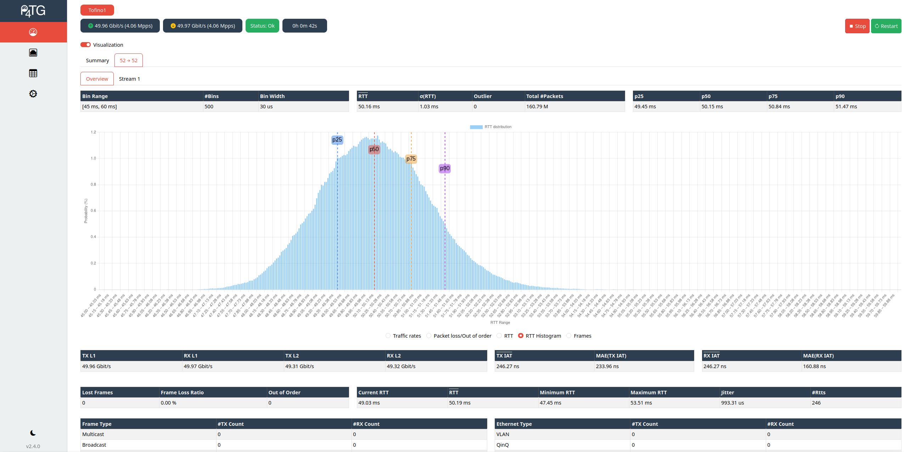

<div align="center">
 
 <h2>P4TG: Traffic Generation for Ethernet/IP Networks</h2>

     [](https://github.com/uni-tue-kn/P4TG/actions/workflows/docker-image.yml) [](https://github.com/uni-tue-kn/P4TG/actions/workflows/docker-sde-image.yml)

</div>

- [Overview](#overview)
- [Installation & Start Instructions](#installation--start-instructions)
  - [Data plane](#data-plane)
  - [Control plane](#control-plane)
- [Development](#development)
- [Changelog](./CHANGELOG.md)
- [Documentation](#documentation)
- [Preview](#preview-of-p4tg)

## Overview 
This repository contains the source code for a P4 based traffic generator based on the Intel Tofino(TM) ASIC, called P4TG (<a href="https://ieeexplore.ieee.org/document/10048513">Paper</a>).
The paper version corresponds to *v.1.0.0*.

In generation mode, P4TG is capable of generating traffic up to 1 Tb/s split across 10x 100 Gb/s ports. 
With Intel Tofino(TM) 2, P4TG is capable of generating traffic up to 4 Tb/s split across 10x 400 Gb/s ports.
Thereby it measures rates directly in the data plane. Generated traffic may be fed back from the output to the input ports, possibly through other equipment, to record packet loss, packet reordering, IATs and sampled RTTs. 
In analysis mode, P4TG measures rates on the input ports, measures IATs, and forwards traffic through its output ports. 

- P4TG (v2.0.0) supports VLAN (802.1Q) and QinQ (802.1ad) encapsulation
- P4TG (v2.1.0) further supports MPLS 
- P4TG (v2.2.0) supports VxLAN
- P4TG (v2.3.0) supports the Intel Tofino 2 with up to 4 Tb/s
- P4TG (v2.3.2) supports IPv6, SRv6 (Tofino 2 only), many bug fixes, and a dark mode

See [Changelog](./CHANGELOG.md) for a full changelog.

P4TG consists of:

- a P4 program for the Intel Tofino(TM)
- Rust control plane
- React configuration GUI

### Features

| **Feature**       | **Status**                           |
|-------------------|--------------------------------------|
| Statistics        | ✅ Available (Implemented)           |
| Tofino 1 support  | ✅ Available (Implemented)           |
| Tofino 2 support  | ✅ Available (Implemented)           |
| Web frontend      | ✅ Available (Implemented)           |
| Rust backend      | ✅ Available (Implemented)           |
| Ethernet          | ✅ Available (Implemented)           |
| IPv4              | ✅ Available (Implemented)           |
| IPv6              | ✅ Available (Implemented)           |
| QinQ              | ✅ Available (Implemented)           |
| MPLS              | ✅ Available (Implemented)           |
| VLAN              | ✅ Available (Implemented)           |
| VxLAN             | ✅ Available (Implemented)           |
| SRv6              | ✅ Available (Implemented)           |
| ARP replies       | ✅ Available (Implemented)           |
| Dark mode         | ✅ Available (Implemented)           |
| Test profiles     | ⚠️ Experimental (Unstable)           |
| File reporting    | ⚠️ Experimental (Unstable)           |
| Auto. testing     | ⚠️ Experimental (Unstable)           |
| Localization      | ⚠️ Experimental (Unstable)           |
| NDP               | ⏳ Planned (Not yet implemented)     |
| NETCONF           | ⏳ Planned (Not yet implemented)     |


## Installation & Start Instructions

### Data plane

Go to `P4-Implementation` and compile p4tg via `make compile`. 
This compiles the program and copies the resulting configs to the target directory.

Afterwards, start p4tg via `make start`.

- **For Intel Tofino1**, run `make compile TARGET=tofino` and `make start TARGET=tofino`.
- **For Intel Tofino2**, run `make compile TARGET=tofino2` and `make start TARGET=tofino2`.

This requires a fully setup [SDE](https://github.com/p4lang/open-p4studio) with set `$SDE` and `$SDE_INSTALL` environment variables.

Tested on:
  - SDE 9.9.0 (up to v2.0.0)
  - SDE 9.13.0 
  - SDE 9.13.1
  - SDE 9.13.2
  - SDE 9.13.3
  - SDE 9.13.4

### Control plane

The controller is written in Rust and can be started via `cd Controller && docker compose up`. This will pull a prebuilt docker image.

The controller then starts a REST-API server at port `P4TG_PORT` and endpoint `/api` (see `docker-compose.yaml`) that is used to communicate with the configuration GUI.
It also serves the configuration GUI at port `P4TG_PORT` and endpoint `/`.
The configuration GUI can then be accessed at http://*ip-of-tofino-controller*:`P4TG_PORT`

#### Configuration 

Set `SAMPLE=1` in `docker-compose.yaml` to activate IAT sampling mode instead of data plane measurement.
Data plane measurement mode (`SAMPLE=0`) is more accurate and the default.

Set `LOOPBACK=true` in `docker-compose.yaml` to configure all ports in loopback mode. This is only useful for testing.

#### Config file 

The configuration file in `Controller/config.json` can be used to specify the ports that are used for traffic generation.
If no config file is provided, the first 10 ports are used. 

Further, the MAC address can be specified that should be used to answer ARP requests when the `ARP reply` option is enabled in the UI.

#### Connection to REST-API server

Connect to the REST-API server through the frontend of the configuration GUI: http://*ip-of-tofino-controller*:`P4TG_PORT`/api

### Development

The configuration GUI is automatically served by the controller at http://*ip-of-tofino-controller*:`P4TG_PORT` and is included in the prebuilt docker image.

If you want to adapt the configuration GUI, or the control plane:
- Start the controller with `RUST_LOG=info cargo run` from inside the `Controller` folder. The controller communicates via the gRPC port (default: 50052) with the data plane.
- Re-build the configuration GUI via `npm install && npm start` within the `Configuration GUI` folder.
- Adapt the `API_URL` in the `config.ts` to run the controller and configuration GUI independently.

Afterward, re-build the controller via `docker compose build` within the `Controller` folder.
This will automatically build and copy the configuration GUI into the controller folder and create an image containing the modifications.

# Update Guide

If you update to a newer version, it might be necessary to delete your local storage in your browser for the configuration GUI.

# Documentation

The documentation of the REST-API can be found [here](https://uni-tue-kn.github.io/P4TG/) or at the `/api/docs` endpoint in the REST-API of the controller.

## Preview of P4TG




# Cite
If you use P4TG in any of your publications, please cite the following papers:
1. S. Lindner, Marco Häberle, and M. Menth: [P4TG: 1 Tb/s Traffic Generation for Ethernet/IP Networks](https://ieeexplore.ieee.org/abstract/document/10048513), in IEEE Access, vol. 11, p. 17525 – 17535, Feb. 2023, IEEE
2. F. Ihle, E. Zink, S. Lindner, and M. Menth: Enhancements to P4TG: Protocols, Performance, and Automation, in KuVS Fachgespräch "Network Softwarization", online, Feb. 2025

```tex
@article{LiHae23,
  title   = {{P4TG: 1 Tb/s Traffic Generation for Ethernet/IP Networks}},
  author  = {Steffen Lindner and Marco Häberle and Michael Menth},
  journal = {{IEEE Access}},
  year    = 2023,
  month   = feb,
  volume  = 11,
  pages   = {17525--17535}
}

@article{IhZi25,
  title  = {{Enhancements to P4TG: Protocols, Performance, and Automation}},
  author = {Fabian Ihle and Etienne Zink and Steffen Lindner and Michael Menth},
  journal = {{KuVS Fachgespräch "Network Softwarization"}}
  year   = 2025,
  month  = apr
}
```