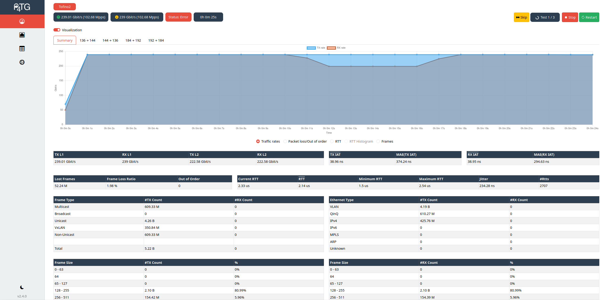
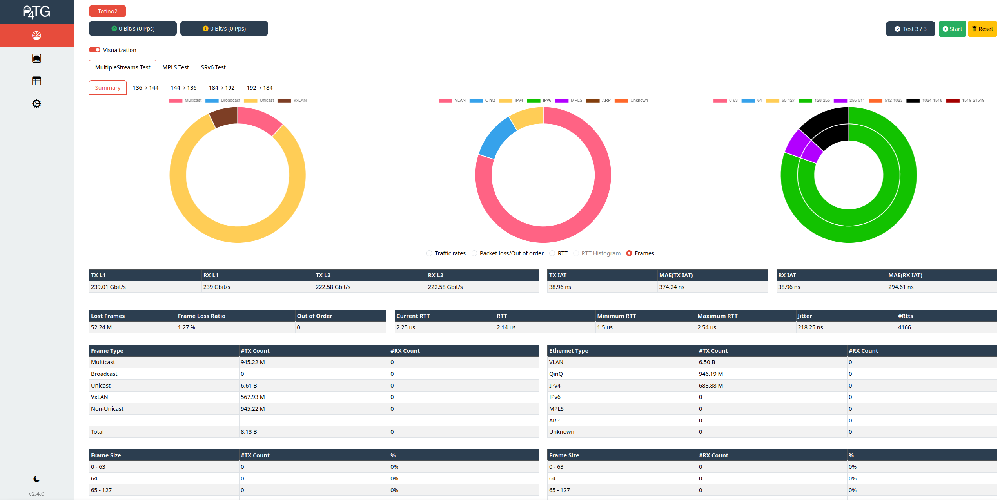
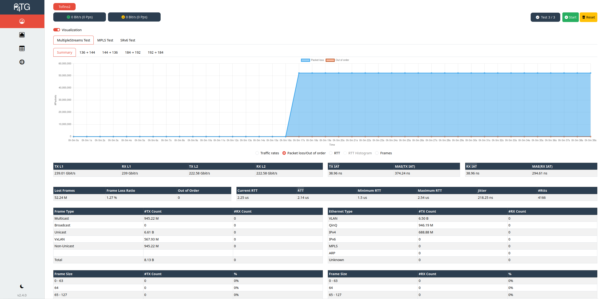

 
 <h2>P4TG: Traffic Generation for Ethernet/IP Networks</h2>

     

- [Overview](#overview)
- [Installation & Start Instructions](#installation--start-instructions)
  - [Data plane](#data-plane)
  - [Control plane](#control-plane)
  - [Configuration GUI](#configuration-gui)
- [Changelog](./CHANGELOG.md)
- [Documentation](#documentation)
- [Preview](#preview-of-p4tg)

## Overview 
This repository contains the source code for a P4 based traffic generator based on the Intel Tofino(TM) ASIC, called P4TG (<a href="https://ieeexplore.ieee.org/document/10048513">Paper</a>).
The paper version corresponds to *v.1.0.0*.

In generation mode, P4TG is capable of generating traffic up to 1 Tb/s split across 10x 100 Gb/s ports. 
With Intel Tofino(TM) 2, P4TG is capable of generating traffic up to 4 Tb/s split across 10x 400 Gb/s ports.
Thereby it measures rates directly in the data plane. Generated traffic may be fed back from the output to the input ports, possibly through other equipment, to record packet loss, packet reordering, IATs and sampled RTTs. 
In analysis mode, P4TG measures rates on the input ports, measures IATs, and forwards traffic through its output ports. 

- P4TG (v2.0.0) supports VLAN (802.1Q) and QinQ (802.1ad) encapsulation
- P4TG (v2.1.0) further supports MPLS 
- P4TG (v2.2.0) supports VxLAN
- P4TG (v2.3.0) supports the Intel Tofino 2 with up to 4 Tb/s

P4TG consist of:

- a P4 program for the Intel Tofino(TM)
- Rust control plane
- React configuration GUI

## Installation & Start Instructions

### Data plane

Go to `P4-Implementation` and compile p4tg via `make compile`. 
This compiles the program and copies the resulting configs to the target directory.

Afterwards, start p4tg via `make start`.

**For Intel Tofino2**, run `make compile TARGET=tofino2` and `make start TARGET=tofino2`.

This requires a fully setup SDE with set `$SDE` and `$SDE_INSTALL` environment variables.

Tested on:
  - SDE 9.9.0 (up to v2.0.0)
  - SDE 9.13.0 
  - SDE 9.13.1

### Control plane

The controller is written in rust and can be started via `docker-compose up`. The initial build may take a few minutes.

The controller then starts a REST-API server at port `P4TG_PORT` and endpoint `/api` (see `docker-compose.yml`) that is used to communicate with the configuration GUI.
It also serves the configuration gui at port `P4TG_PORT` and endpoint `/`.

#### Configuration 

Set `SAMPLE=1` in `docker-compose.yml` to activate IAT sampling mode instead of data plane measurement.
Data plane measurement mode (`SAMPLE=0`) is more accurate and the default

#### Config file 

The configuration file in `Controller/config.json` can be used to specify the ports that are used for traffic generation.
If no config file is provided, the first 10 ports are used. 

Further, the MAC address can be specified that should be used to answer ARP requests when the `ARP reply` option is enabled in the UI.

### Configuration GUI

The configuration GUI is based on react & nodejs.
It is automatically served by the controller at http://*ip-of-tofino-controller*:`P4TG_PORT`.

If you want to adapt the configuration GUI, re-build the configuration GUI via `npm run build` within the `Configuration GUI` folder and copy the `build` folder to `Controller/gui_build`. 
Afterward, re-build the controller via `docker-compose build` within the `Controller` folder.

#### Docker

The configuration GUI can also be run independently of the controller.
Adapt the `API_URL` in the `config.ts` if the controller and configuration GUI run on different machines.

To run the configuration GUI via docker-compose run `docker-compose up`.
After the build has finished, the configuration GUI is reachable at `http://127.0.0.1`.
To change the listening port adjust the port in `docker-compose.yml`.

#### Legacy NPM installation

Run `npm install --legacy-peer-deps` to install the nodejs dependencies.
Adapt the `API_URL` in the `config.ts` if the controller and configuration GUI run on different machines.
Afterward run `npm run build` to create a production build and serve the `build/` directory with a webserver of your choice.

#### Connection to REST-API server

Connect to the REST-API server through the frontend of the configuration GUI: http://*ip-of-tofino-controller*:`P4TG_PORT`/api

# Update Guide

If you update to a newer version, it might be necessary to delete your local storage in your browser for the configuration GUI.

# Documentation

The documentation of the REST-API can be found at the `/api/docs` endpoint of the REST-API of the controller.

## Preview of P4TG

