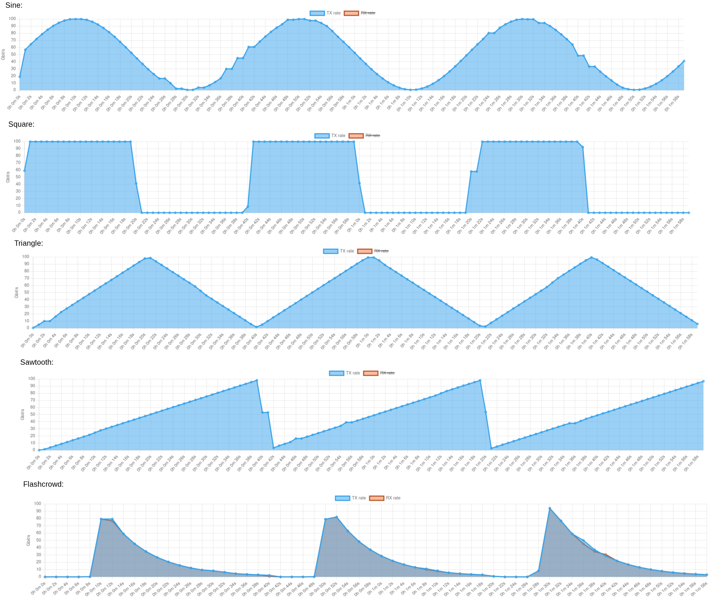

# Changelog 

## v2.7.0
### New features
- Added periodic pattern shaping options: Sine, Triangle, Sawtooth, Square, Flashcrowd.
  - Pattern shaping is applied entirely in the data plane.
  - The period is configurable.
  - Examples:

  
- Added breakout mode for `400G` -> `4x100G` on Tofino 2, allowing up to 40x100G customizable traffic generation.
- Extended `breakout_mode` configuration in `Controller/config.json` to support explicit lane counts:
  - `breakout_mode: 4` for 4-lane breakout
  - `breakout_mode: 8` for 8-lane breakout on Tofino 2 (`400G -> 8x50G/25G/10G`)
- Added backward compatibility for legacy boolean breakout configuration:
  - `breakout_mode: true` is interpreted as `breakout_mode: 4`
  - `breakout_mode: false` disables breakout mode
- Added `BF_SPEED_50G` as a supported port speed in controller and frontend port configuration.
- Added per-channel ARP/MAC runtime configuration in frontend and backend.
  - `POST:/api/ports/arp` now accepts an optional `channel` field.
  - If `channel` is set, ARP + MAC updates apply only to that `(port, channel)`.
  - If `channel` is omitted, ARP + MAC updates apply to all configured channels of that front panel port.
- Added histogram monitoring for TX/RX IATs similar to RTT histograms.
  - ⚠️ API schema changes
    - `histogram_config` in `POST:/api/trafficgen` is now called `rtt_histogram_config` and `iat_histogram_config`
    - `GET:/api/statistics` now contains `rtt_histogram` and `iat_histogram`.
      - Each histogram data collection now contains `rx` and `tx`, where `tx` is always empty for RTT.
      - Mean and std are renamed from `mean_rtt`, `std_rtt` to `mean` and `std`.
- Added support for the GTP-U protocol.
- Added a rename button for names of tests to make the renaming more intuitive.
- Added a button to show/hide the percentile annotations for histograms.
- Added an "undo test deletion" button.
- Added the total, non-formatted number of lost / out-of-order frames as hover text to the stat overview.
- Added the number of lost frames to the Status badge at the top.

### Bug fixes
- Fixed calculation of channel ID from dev port which may lead to crashes in breakout mode.
- Fixed ARP and MAC settings being effectively tied to the base channel in breakout mode.
- Fixed controller startup crash on Tofino 1 when `config.json` contains unsupported port settings (e.g., `BF_SPEED_400G` or `breakout_mode: 8`) by adding ASIC-aware config validation and fallback to defaults.
- Fixed generated traffic exceeding the configured rate if using Poisson generation with Rate Precision mode and batches.
- Fixed unstable IAT due to generation on multiple pipes in IAT precision mode. The IAT precision mode now has a toggle to switch between generation on a single pipe or an all available pipes. The default mode for a stream is now the rate precision mode.
- Fixed errors that get thrown after passing the API validation not being propagated to the frontend.
- Fixed crash for some histogram configs.
- Fixed the stream settings enable button to be disabled during traffic generation.
- Fixed settings export not being available during active traffic generation.
- Fixed the visualization in the frontend degrading due to the limit parameter which derived the number of elements from the time when the experiment started.
- Fixed optional `StreamSettings` fields (VxLAN, GTP-U, VLAN, IPv6, SRv6, MPLS) requiring all fields to be present in the JSON payload, even when disabled. The Rust `#[serde(untagged)]` enum deserialization now correctly defaults missing `Option<T>` fields to `None` via `#[serde(default)]`.
- Fixed API validation not catching missing IPv4 settings when `ip_version` is omitted (defaults to IPv4 downstream).
- Fixed API validation not catching missing `srv6_base_header` for SRv6 encapsulated streams.
- Fixed frontend always sending default values for disabled protocol fields (e.g., VxLAN, GTP-U). Optional `StreamSettings` fields are now omitted from the payload when not required by the stream configuration.
- Fixed stream settings not being populated with defaults when enabling a feature (e.g., VxLAN) without opening the settings modal. Settings are now reconciled automatically at save time.

### Other
- Rust version bump for CI and docker image to 1.91
- Update Controller dependencies
- Added support to run the `p4tg.sh` management script on Asterfusion based devices.
- Added `--nightly` flag to `p4tg.sh` management script.
- Updated SDE install docs.

## v2.6.2
### New features
- Moved the Mpps mode into the CBR mode. The unit for traffic generation (Gbps / Mpps) can now be selected on a per-stream basis. For backward compatibility, the Mpps mode is still supported by the REST API.
- Added an install and management script: 
  ```bash
  ./p4tg.sh [install|update|start|stop|restart|status]
  ```
- Added an update checker to the frontend.

## v2.6.1
- Fix breakout mode if `speed` is not manually configured in `config.json`.
GET:/api/statistics`
## v2.6.0
- Breakout mode: P4TG now supports traffic generation via breakout channels, i.e., 1x100G -> 4x25G and 1x40G -> 4x10G. Each channel can be configured individually. Breakout mode for a port must be configured in `config.json`:
```json
     {
      "port": 1,
      "mac": "fa:a6:68:e0:3d:70",
      "breakout_mode": true,
      "speed": "BF_SPEED_100G"
    }
```
- ⚠️ API schema changes
  - `POST:/api/trafficgen` now requires Port<->Channel mappings for `port_tx_rx_mapping` and `histogram_config`.
    - You can convert your existing trafficgen config to the new schema by uploading them through the 'Import' feature in the frontend and exporting them.
  - `GET:/api/statistics` and `GET:/api/time_statistics` now return a list of channels with stats per port.
- Support for 64-port Tofino switches: Set the maximum number of front panel ports in `docker-compose.json` to enable.
- More options in `config.json` available: Speed, FEC, Breakout mode, and Auto Negotiation can be pre-configured. Further, TX/RX recirculation ports can be configured manually:
```json
    {
      "port": 49,
      "mac": "fa:a6:68:e0:3d:70",
      "speed": "BF_SPEED_100G",
      "recirculation_ports": {
        "tx": {
          "port": 50,
          "speed": "BF_SPEED_100G"
        },
        "rx": {
          "port": 51,
          "speed": "BF_SPEED_100G"
        }
      }
    }
  ```
- Possible values are:
  - speed: BF_SPEED_10G, BF_SPEED_25GB, BF_SPEED_40G, BF_SPEED_100G, BF_SPEED_400G
  - auto_negotiation: PM_AN_DEFAULT, PM_AN_FORCE_ENABLE, PM_AN_FORCE_DISABLE
  - fec: BF_FEC_TYP_NONE, BF_FEC_TYP_FC, BF_FEC_TYP_REED_SOLOMON
- Added warning message if configured generation rate exceeds line rate of a port.
- Added warning message if active stream rate exceeds maximum possible rate.
- Increased data plane table sizes to accomodate more streams and ports.
- Added a Python framework for test automation.

### Bug fixes
- Fix RX frame type and Ethernet type not being counted.
- Fix percentile calculation in some special cases.
- Fix statistics collection on Tofino 2 if more than 7 streams are generated.
- Fix `GET:/api/restart` endpoint.
- Fix config validation if a Tofino-2-only config is imported on a Tofino 1 device.
- Fix inactive streams being considered for calculation of maximum rate.
- Fix for CVE-2025-58754.
- Updated API docs.
- Updated dependencies.

## v2.5.0
### New features
- ⚠ Breaking change: Port configuration for StreamSettings, TX/RX port mapping, histograms, port config, ARP config, statistics and time_statistics now use the front panel numbers (e.g., 1-10) instead of dev_port numbers. This makes exported configurations portable across different Tofino devices.
- ⚠ Schema change: `GET:/api/statistics` and `GET:/api/time_statistics` now returns an array of all test results. This facilitates data analysis.
- Increase the number of supported streams to 15 on Tofino 2.
- Percentiles to calculate from RTT histogram data are now configurable via the histogram_config struct in `POST:api/trafficgen`. Defaults to [0.25, 0.5, 0.75, 0.9].
- Added JSON export feature of collected statistics over time after a test.
- Display 'Status: Error' on dashboard if a histogram measurement has outliers.
- Replaced alert() popups with Bootstrap ToastMessages.
- Added button to clone test configuration in frontend settings.
- Only export active stream settings on settings export, reducing the size of the exported settings file by up to 90%.
- Data returned from `GET:/api/statistics` and `GET:/api/time_statistics` now only contains data for active ports (either contained in stream_settings, or in tx_rx_mapping). This reduces the overall size of the HTTP response by up to 90%.

### Bug fixes
- Add missing API doc for `POST:/api/ports/` endpoint.
- Add API doc for POST:/api/traffic_gen with multiple test definitions.
- Removed `POST:/api/histogram` endpoint. This feature is included in `POST:api/trafficgen`.
- Added example for histogram configuration to `POST:api/trafficgen` API doc.
- Fix crash if no TX RX mapping is configured.
- Fix disabling of streams whose TX port is down in frontend (again).
- Fix stats not being shown in frontend for the most recent test if multiple tests were conducted and the last test was aborted.
- Fix frontend crash if the backend controller is not reachable.
- Fix displayed number of tests on dashboard.
- Fix a crash if histogram settings in one of multiple tests where invalid.
- Fix results not being rendered for multiple tests in frontend, if tests were triggered via direct REST API calls.
- Streamlined settings validation in backend. Validation errors are now properly propagated, even for multiple tests.
- Fix crash of settings import of malformed data.
- Fix port and stream setting config validation on settings import.

## v2.4.0
### New features
- Live RTT histogram generation (#16)
  - The range for the histogram (minimum and maximum) and the number of bins can be configured on a per-port basis.
    - The configuration is available in the front end in the RX port settings or via the REST API.
  - Packets are matched to bins in the data plane based on the configured histogram settings (no sampling required).
  - The .25, .50, .75 and .90 percentiles are calculated based on the histogram data.
  - The mean and standard deviation are also calculated based on the histogram data. Depending on the histogram configuration, these calculations may yield more accurate results than sampling.
  - The histogram is rendered in the front end.
  - The `GET:api/statistics` endpoint contains the histogram configuration and data for each RX port.
- New API endpoints for histogram configuration: `POST:api/histogram` for histogram configuration and `GET:api/histogram` to retrieve configuration.
  - Histograms can also be configured using the `POST:api/trafficgen` endpoint.
- Test automation by providing a list of tests
  - The `POST:api/trafficgen` endpoint now accepts either a single TrafficGen object, or a list of TrafficGen objects for test automation
  - Configuration of multiple sequential tests is available in the frontend settings
  - Visualization and statistics per test are available in the frontend and are provided in the `GET:api/statistics` and `GET:api/time_statistics` endpoints
  - The `DELETE:api/trafficgen` is extended with an optional `skip: boolean` parameter to skip a single test
  - Objects in / for `POST:api/trafficgen`, `GET:api/trafficgen`, `GET:api/statistics`, and `GET:api/time_statistics` now have an optional `name` and `histogram_config` entry

### Bug fixes
- Fixed text color in Modals in dark mode
- Fixed frontend crash if controller goes offline
- Fixed bug in port validation on settings import
- Added missing API docs for `online` endpoint
- Fixed RX frame type statistic for ARP frames in frontend
- Fixed stream setting button enabled while traffic generation is running
- Changed the P4 Makefile to work with open-p4studio

## v2.3.3
### Bug Fixes
- Fixed a crash of the P4TG controller after several hours
- Fixed text color for InfoModals in dark mode

### Other
- Updated dependencies for backend in `Controller/Cargo.toml` and frontend in `Configuration GUI/package.json`

## v2.3.2
### New Features
- Add IPv6 support
  - Randomization with least-significant 48-bits in source / destination address
- Add CI for data plane build.
- Add dark mode.
- Add SRv6 support.
  - Tofino 2 only.
  - Up to 3 SIDs.
  - Add IP tunneling toggle for SRv6.
- Introduce loopback mode per controller flag.
- Add configuration option to increase burstiness of traffic in rate mode for achieving a more accurate rate.
- Add configuration option to set the duration of a test in seconds.

### Bug Fixes
- Fix StreamSettings rendering in frontend if Controller API was used directly.
- Fix "Sum of stream rates" error in frontend for inactive streams
- Fix bug on settings import if no port mapping is configured.
- Fix bug on settings import if not all ports are defined in JSON file.
- Fix validation of port settings on import in frontend.
- Fix backwards compatibility on config import from older P4TG versions.
- Fix compilation on SDE 9.13.4 for Tofino 1.
- Fix MPLS Encapsulation bug in frontend.
- Fix frame type monitor for IPv6 traffic.
- Fix CI issues.
- Fix field validation for stream settings.
- Fix IP settings being shown if no IP tunneling is used with SRv6.
- Fix UDP checksum calculation for SRv6 with multiple SIDs.
- Fix SRv6 compilation on Tofino 1.
- Fix traffic generation for 64-byte frames with IPv6 on Tofino 2.
- Fix traffic generation in Mpps mode
- Fix errors in GUI build.
- Fix stream settings related issues when TX port goes down.
- Fix ASIC detection.
- Fix compile flags and README updates.
- Fix IPv6 UDP checksum calculation
- Fix docker build of controller (#22)
- Disallow MPLS with VxLAN on Tofino 1 to enable SDE 9.13.4.
- Add missing API documentation.
- Add config validation for available TX/RX ports.
- Automatically disable active stream setting if port goes down.

## v2.3.0
- Add support for Intel Tofino2 (data plane / control plane / configuration UI)
  - supports traffic generation with up to 4 Tb/s (10x 400 Gb/s)
- Update `/api/online` endpoint that now returns ASIC version (Tofino1 / Tofino2) and version number
- Update stream settings ui to allow to disable a stream if port is not up
  
## v2.2.1
- Better support for 4-pipe Tofino
  - Increase meter entries & register entries to 512 to be able to use ports with PID > 255
- Bug in analyze mode that returned an error when no streams / stream settings were provided
- Preliminary import/export function for settings
- Fix bug that prevents that ARP replies are always generated in ANALYZE mode

## v2.2.0
- Added VxLAN support
- Added infobox in UI to get further information on features
- Random Ethernet src addresses are now always unicast
- Detection mechanism that clears local storage if stored streams do not have all required properties
  - This may be the case if an update introduces new properties, but the old stored values in local storage dont have them
- Refactor Configuration GUI code
- Switch to utoipa + swagger-ui for REST-API docs
- Add `config.json` file that can be used to specify the traffic generation (front panel) ports
- Add `ARP Reply` option in UI. If enabled, the switch answers all ARP requests that it receives on that port.

### Refactor REST-API endpoint `/api/trafficgen` 
- Endpoint `/api/trafficgen` refactored to better reflect encapsulation methods
- Streamsettings are now grouped according to protocol (see `/api/docs` for examples)
  - Ethernet related configuration (src & dst mac) are now under `ethernet`
  - VLAN & QinQ related configuration are now under `vlan`
  - IP related configuration are now under `ip`
  - Fields (`vlan`, `mpls_stack`, `vxlan`) are only required if corresponding encapsulation is active
- `number_of_lse` in stream description is now only required if MPLS encapsulation is used
  
## v2.1.2
- Added RTT visualization
- Cleaner monitoring routine in controller
- Add "port clearance" before P4TG starts. May be needed if other systems configure the switch (e.g., SONiC). See https://github.com/uni-tue-kn/P4TG/issues/6

## v2.1.1

- UI bug-fix total TX/RX frame tpes
- Remove "non-unicast" from frame chart

## v2.1.0

- Added MPLS support with up to 15 MPLS labels
- Integrated configuration GUI webserver in controller
  - The configuration GUI is now also served at `http://ip-of-controller:controller-port`
- Moved REST-API to `/api` endpoint of the controller. It is now served at `http://ip-of-controller:controller-port/api`
- Added visualization on the GUI for traffic rates, packet loss & out of order, frame statistics
## v2.0.0 

### Have you considered Rewriting It In Rust?

v.2.0.0 includes several improvements over v1.0.0.

- Added VLAN & QinQ encapsulation
- Added Ethernet type counter (VLAN, QinQ, IPv4, IPv6, Unknown)
- Switched to data plane mean IAT & MAE (mean absolute error) measurement
  - Sample mode (as in v.1.0.0) available via Controller environment variable (`SAMPLE=1`)
  - Data plane mode (`SAMPLE=0`) is more accurate and the default
- Configuration GUI re-design & enhancements / bug fixes
- **Rewrite of the control plane in Rust**
- REST-API endpoint documentation
