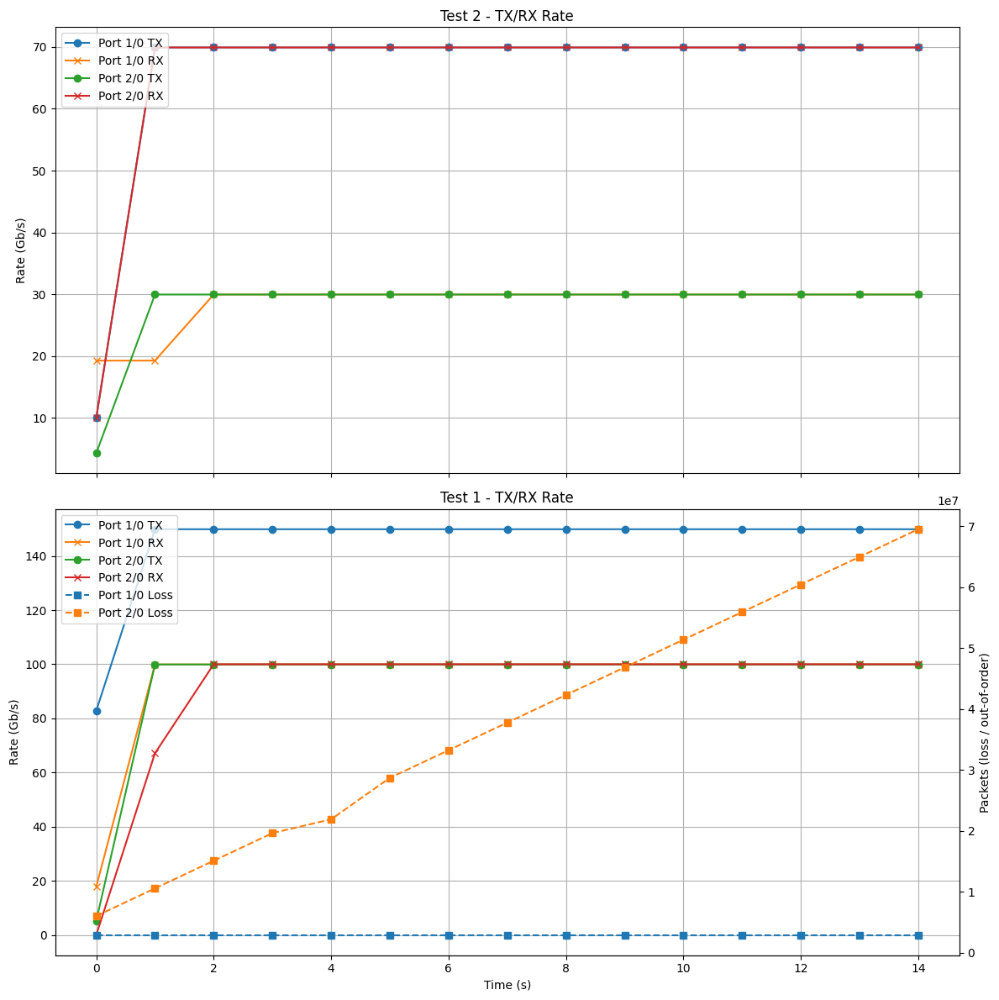
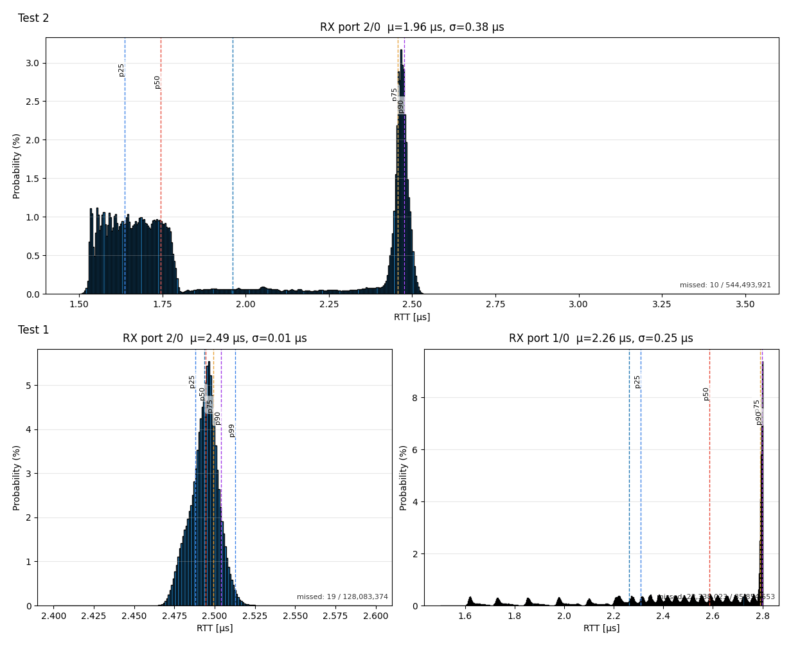

# P4TG Test Automation with Python
This python module lets you launch P4TG tests, wait for them to finish, pull stats from the REST API, and plot time-series rates and RTT histograms—fully automated from the command line.

## Setup
```bash
python -m venv .venv
source .venv/bin/activate        # Windows: .venv\Scripts\activate
pip install -r requirements.txt 
```


## Usage
```bash
python run.py --payload payloads/your_test.json \
              --base-url http://localhost:8000/api \
              --show-plots true
```
### Arguments

- `--payload` (required): Path to a JSON payload describing one test or a list of tests.
- `--base-url` (default: http://localhost:8000/api): P4TG REST endpoint.
- `--show-plots` (true/false, default: false): Show interactive plots in addition to saving PDFs.

### What happens
1. Sends the payload to `/trafficgen`.
2. Waits for the test(s) to complete (or auto-stops after 20s if a test has duration: 0).
3. Fetches:
   - `/time_statistics` → TX/RX rate, packet loss, out-of-order packets over time
   - `/statistics` → RTT histograms per RX port/channel
4. Saves plots under `results/`:
    - `<payload_stem>_histogram_all.pdf` — all histogram subplots
    - `<payload_stem>_txrx_rates.pdf` — time series of rates (and optionally loss/out-of-order)


## Building Payloads
The payload mirrors the UI configuration.
 **Best practice:** build your test in the frontend and export it via the Settings → Export button, then save it into the `payloads/` folder as a `.json` file.

### Example Payloads
The `payloads/` folder contains some ready-to-run examples:

- `2streams_100G_SRv6_infinite`
  - Generates two streams between port 1 and 2
  - Each has 100G
  - One has SRv6 encapsulation
  - Runs indefinitely (the runner will auto-stop after ~20 s)
- `3streams_100G_mixed_25s`
  - Two tests back-to-back (15 s and 10 s)
  - Each test generates 3 streams with 100 G, 50 G, and 100 G with mixed encapsulations
- `3streams_120G_histogramConfig_30s`
  - Two tests back-to-back (15 s and 15 s)
  - Sending more than line rate through a single port to cause packet loss
  - 3 streams with different frame sizes to cause different RTTs
  - Histogram config tailored to the expected RTT


### Output
- Results are written to the `results/` directory.
- Filenames are derived from your payload path (e.g., `payloads/my_test.json` → `results/my_test_histogram_all.pdf`).

### Preview
The plots below are generated from the `3streams_120G_histogramConfig_30s` payload.

#### Rates
[](3streams_120G_histogramConfig_30s_rates.png)

#### Histograms
[](3streams_120G_histogramConfig_30s_histogram_all.png)