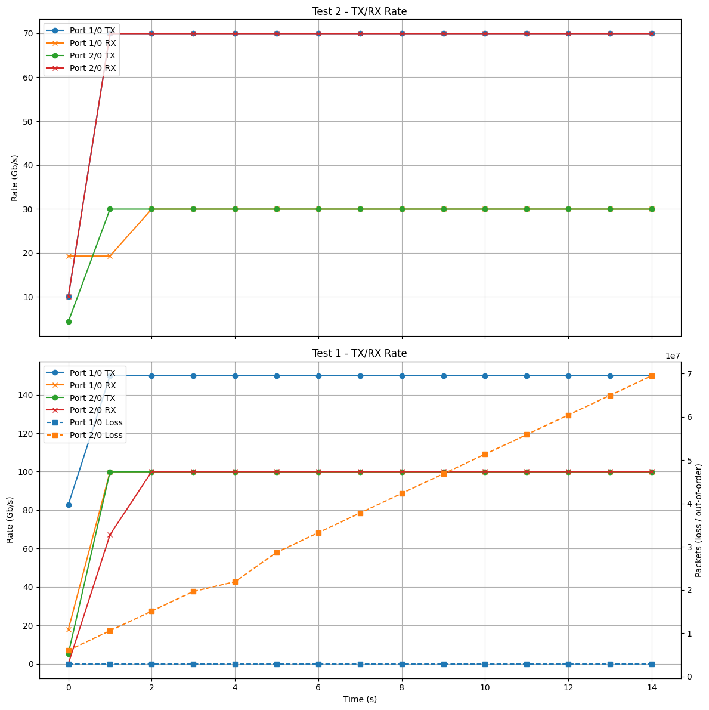
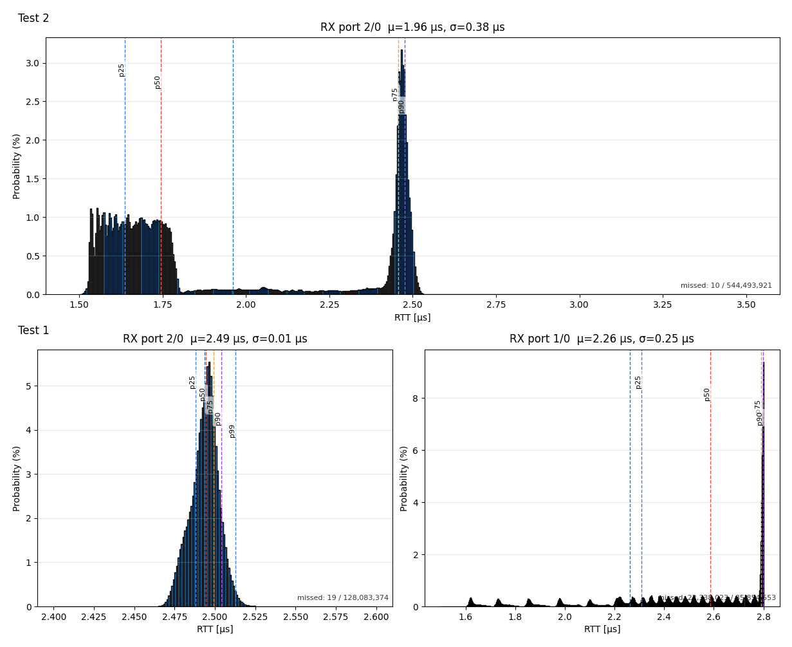

# P4TG Test Automation with Python
This python module lets you launch P4TG tests, wait for them to finish, pull stats from the REST API, and plot time-series rates plus RTT/IAT histograms—fully automated from the command line.

## Setup
```bash
python -m venv .venv
source .venv/bin/activate
pip install -r requirements.txt 
```


## Usage
```bash
python run.py --payload payloads/your_test.json \
              --base-url http://localhost:8000/api \
              --show-plots true
```
### Arguments

- `--payload` (required): Path to a JSON payload describing one test or a list of tests.
- `--base-url` (default: http://localhost:8000/api): P4TG REST endpoint.
- `--show-plots` (true/false, default: false): Show interactive plots in addition to saving PDFs.
- `--rfc2544-timeout` (default: 1800): Maximum wait time in seconds for an RFC2544 run.
- `--log-level` (default: INFO): Verbosity of script progress output (`DEBUG`, `INFO`, `WARNING`, `ERROR`).
- `--configure-ports`: Configure ports 1/0 and 2/0 before the test starts.

### What happens
1. Sends the payload to `/trafficgen`.
2. Waits for the test(s) to complete (or auto-stops after 20s if a test has duration: 0).
3. Fetches:
   - `/time_statistics` → TX/RX rate, packet loss, out-of-order packets over time
   - `/statistics` → RTT and IAT histograms (IAT TX/RX)
4. Saves plots under `results/`:
    - `<payload_stem>_histogram_rtt.pdf` — RTT histograms
    - `<payload_stem>_histogram_iat_tx.pdf` — IAT TX histograms
    - `<payload_stem>_histogram_iat_rx.pdf` — IAT RX histograms
    - `<payload_stem>_rates.pdf` — time series of TX/RX rates
    - `<payload_stem>_packet_loss.pdf` — packet loss (and optional out-of-order) time series

### RFC2544 Example
The `payloads/rfc2544_10G_64_128.json` payload demonstrates an automated RFC2544 run through the REST API.
It uses one active packet template on port `1/0`, maps RX to `2/0`, and runs zero-loss throughput, latency, and frame-loss testing for 64 B and 128 B frames with short trial timings.

```bash
python run.py --payload payloads/rfc2544_10G_64_128.json \
              --base-url http://localhost:8000/api \
              --configure-ports \
              --rfc2544-timeout 600 \
              --report
```

For RFC2544 payloads, the runner polls `/statistics` until `rfc2544.running` becomes `false`.
If the frontend export contains a single RFC2544 test inside a one-element JSON list, the runner posts that test as a single object because the controller does not allow RFC2544 inside multiple-test runs.
It then saves the raw API statistics as before and additionally writes RFC2544 summaries and plots:

- `<payload_stem>_rfc2544_summary.json` — complete RFC2544 result block from `/statistics`
- `<payload_stem>_rfc2544_throughput.csv` and `.pdf` — zero-loss throughput by mapping and frame size
- `<payload_stem>_rfc2544_latency.csv` and `.pdf` — RTT/2 latency by mapping and frame size
- `<payload_stem>_rfc2544_frame_loss.csv` and `.pdf` — frame-loss percentage over offered load
- `<payload_stem>_rfc2544_reset.csv` and `.pdf` — reset-time results, if selected
- `<payload_stem>_rfc2544_system_recovery.csv` and `.pdf` — system-recovery results, if selected
- `<payload_stem>_report.pdf` — controller-generated report with RFC2544 results when available, general P4TG statistics, plots, frame-size distributions, histograms, and DUT metadata if `--report` is set

The PDF report is generated through `POST /api/report`. Pass `--report-metadata metadata.json` to include DUT/test metadata; omitted fields default to `n/a`.

Reset and system-recovery are disabled in the example payload. Enable them in the `rfc2544` section if the DUT/link behavior needed for those tests is available.


## Building Payloads
The payload mirrors the UI configuration.
 **Best practice:** build your test in the frontend and export it via the Settings → Export button, then save it into the `payloads/` folder as a `.json` file.

### Example Payloads
The `payloads/` folder contains some ready-to-run examples:

- `2streams_100G_SRv6_infinite`
  - Generates two streams between port 1 and 2
  - Each has 100G
  - One has SRv6 encapsulation
  - Runs indefinitely (the runner will auto-stop after ~20 s)
- `3streams_100G_mixed_25s`
  - Two tests back-to-back (15 s and 10 s)
  - Each test generates 3 streams with 100 G, 50 G, and 100 G with mixed encapsulations
- `3streams_120G_histogramConfig_30s`
  - Two tests back-to-back (15 s and 15 s)
  - Sending more than line rate through a single port to cause packet loss
  - 3 streams with different frame sizes to cause different RTTs
  - Histogram config tailored to the expected RTT
- `rfc2544_10G_64_128`
  - RFC2544 API orchestration example
  - Port mapping `1/0 -> 2/0`
  - Runs throughput, latency, and frame-loss tests for 64 B and 128 B frames


### Output
- Results are written to the `results/` directory.
- Filenames are derived from your payload path (e.g., `payloads/my_test.json` → `results/my_test_histogram_rtt.pdf`).

### Preview
The plots below are generated from the `3streams_120G_histogramConfig_30s` payload.

#### Rates
[](3streams_120G_histogramConfig_30s_rates.png)

#### Histograms
[](3streams_120G_histogramConfig_30s_histogram_all.png)
